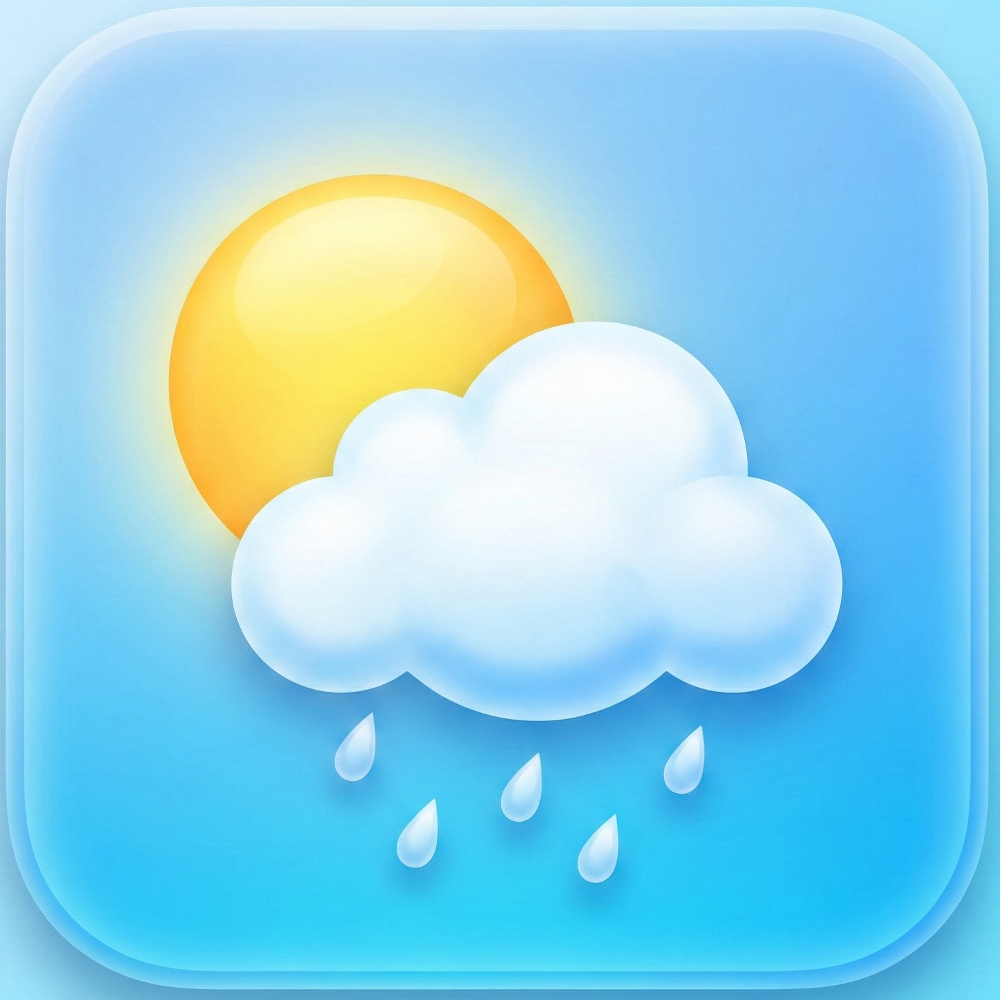

# SappyWeather

A premium weather app for Android with multiple selectable themes — from cyberpunk neon HUDs to soft pastel gradients. Real-time weather data, smart notifications, and a beautiful adaptive UI. Built with Flutter.

<p align="center">
  
</p>

---

## Features

- **Real-time weather** via Open-Meteo API (no API key needed)
- **GPS auto-detect** + manual city search with geocoding
- **24-hour forecast** with scrollable timeline
- **10-day forecast** with temperature range bars
- **Air Quality Index** with pollutant breakdown (PM2.5, PM10, O3, NO2)
- **What to wear** — clothing advice based on conditions
- **Rain timeline** — minute-by-minute precipitation outlook
- **Sunrise/sunset countdown** with progress arc
- **Smart notifications** — morning briefing, evening outlook, severe weather alerts, trend insights
- **Advanced metrics** — atmosphere, wind, precipitation, UV (toggleable)
- **Responsive layout** — portrait, landscape, and tablet support
- **Easter egg** — tap the cloud icon 7 times for the debug weather FX simulator

## Themes

SappyWeather ships with **6 built-in themes**, switchable at runtime from Settings:

| Theme | Style |
|-------|-------|
| **Cyberpunk** | Neon HUD, glitch effects, particle rain/snow/lightning, scanlines |
| **Clean** | Minimal dark gradients, smooth transitions |
| **Pastel** | Soft lavender/mint/peach, rounded corners, light mode |
| **Pastel Dark** | Deep purple-black with soft lavender accents |
| **Sunset** | Warm amber and coral tones on dark backgrounds |
| **Ocean** | Deep sea blues and teals with aqua accents |

Each theme has its own splash screen, weather-reactive gradients, and card styling.

## Tech Stack

- **Framework**: Flutter 3.38.9 (Dart 3.10.8)
- **State management**: Provider
- **Weather API**: [Open-Meteo](https://open-meteo.com/)
- **Location**: geolocator + geocoding
- **Storage**: shared_preferences
- **Notifications**: flutter_local_notifications + Firebase Cloud Messaging
- **Background sync**: workmanager
- **Animations**: flutter_animate + CustomPainter FX engine

## Getting Started

### Prerequisites

- Flutter SDK >= 3.38.9
- Android SDK (minSdk 26)
- Java 17

### Run

```bash
git clone https://github.com/ShaptakNaskar/weatherman.git
cd weatherman
flutter pub get
flutter run
```

### Build APK

```bash
# Debug
flutter build apk --debug

# Release (requires android/key.properties with keystore credentials)
flutter build apk --release
```

## Architecture

```
lib/
├── main.dart
├── config/
│   ├── constants.dart
│   ├── app_theme_data.dart          # Abstract theme interface
│   ├── cyberpunk_theme.dart         # Neon/HUD theme
│   ├── clean_theme_data.dart        # Minimal dark theme
│   ├── pastel_theme.dart            # Light & dark pastel themes
│   ├── sunset_theme.dart            # Warm amber theme
│   └── ocean_theme.dart             # Deep sea theme
├── models/
│   ├── location.dart
│   └── weather.dart
├── providers/
│   ├── location_provider.dart
│   ├── settings_provider.dart
│   ├── theme_provider.dart          # Runtime theme switching
│   └── weather_provider.dart
├── screens/
│   ├── home_screen.dart
│   ├── search_screen.dart
│   ├── settings_screen.dart
│   ├── splash_screen.dart
│   ├── splash/                      # Per-theme splash screens
│   └── debug_weather_screen.dart
├── services/
│   ├── weather_service.dart
│   ├── location_service.dart
│   ├── storage_service.dart
│   ├── notification_service.dart
│   ├── background_sync.dart
│   ├── push_service.dart
│   └── widget_service.dart
├── utils/
│   ├── date_utils.dart
│   ├── unit_converter.dart
│   └── weather_utils.dart
└── widgets/
    ├── cyberpunk/                   # Glitch FX, HUD, cyber cards
    ├── pastel/                      # Pastel backgrounds & cards
    ├── themed/                      # Theme-aware wrappers
    ├── common/
    └── weather/                     # Weather display widgets
```

## CI/CD

GitHub Actions automatically builds a signed APK on push to `master` and creates a GitHub Release with the APK attached.

## Permissions

| Permission | Purpose |
|-----------|---------|
| `INTERNET` | Fetch weather data |
| `ACCESS_FINE_LOCATION` | GPS-based weather |
| `ACCESS_COARSE_LOCATION` | Approximate location fallback |
| `ACCESS_BACKGROUND_LOCATION` | Background weather sync |
| `POST_NOTIFICATIONS` | Weather alerts & briefings |
| `RECEIVE_BOOT_COMPLETED` | Restart background sync after reboot |

## Credits

- **Data source**: [Open-Meteo](https://open-meteo.com/)
- **Framework**: [Flutter](https://flutter.dev)

## Developer

Built by [Sappy](https://sappy-dir.vercel.app)

## License

[GNU General Public License v3.0](LICENSE)
